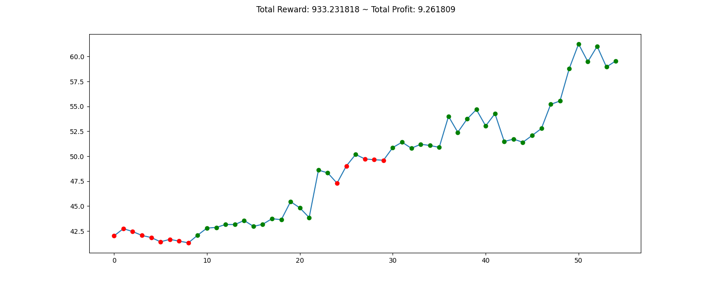
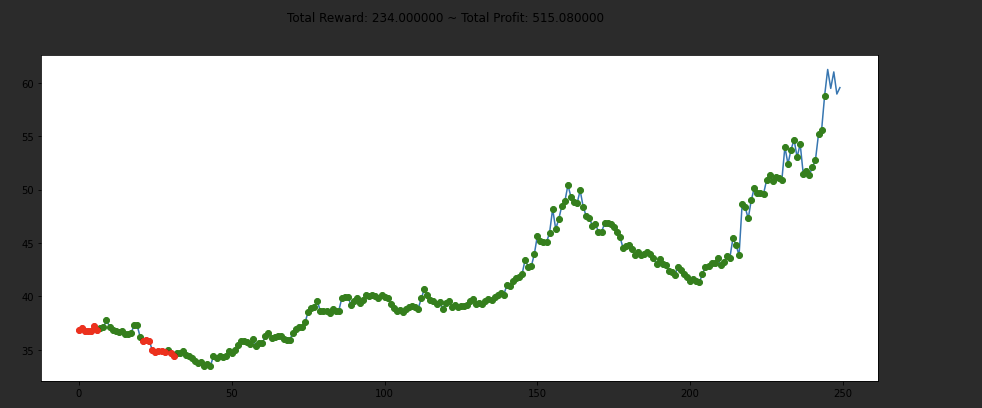
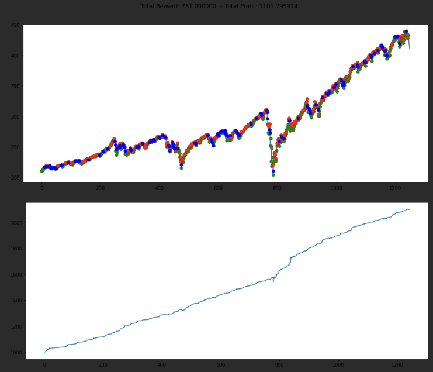
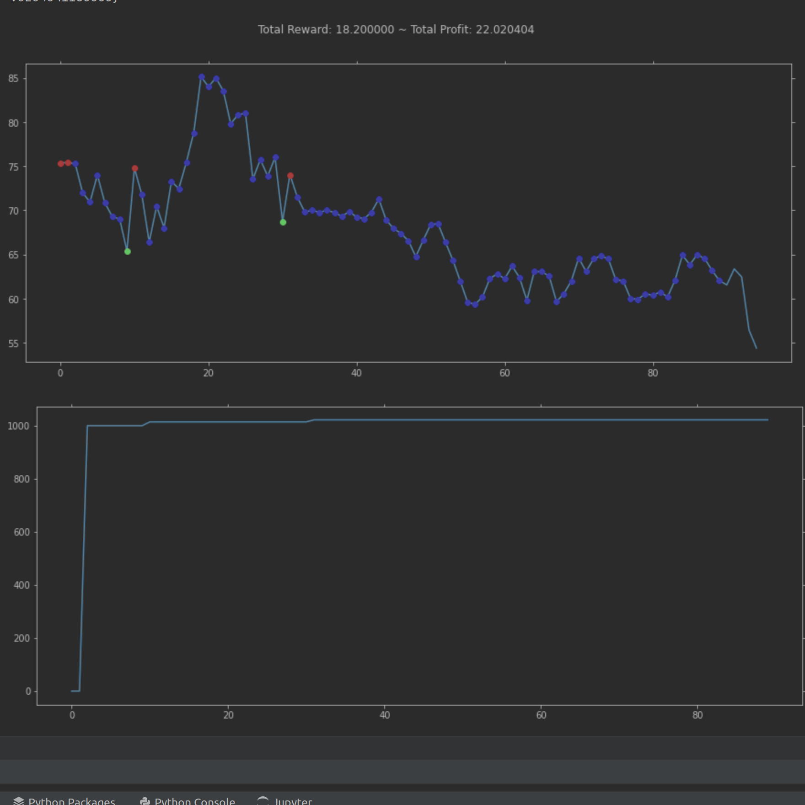
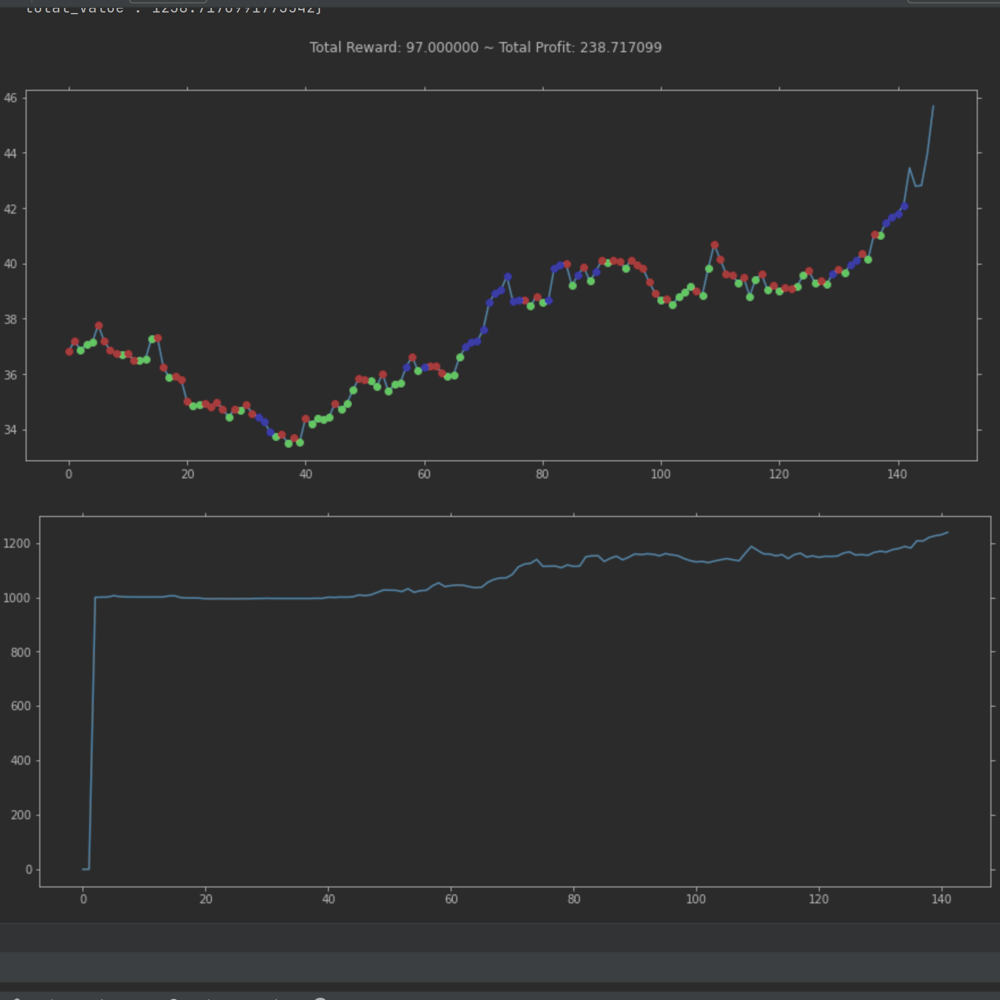

# News Stock Prediction

## Team
[Buhai Darius](https://github.com/DariusBuhai) and [Andrei Arnautu](https://github.com/andreiarnautu)

## Project description
Predict and learn how to trade based on stock prices and news analytics.

## Implementation

 - News Analysis:
   - News are brought from [Google News API](https://newsapi.org/s/google-news-api) and stored locally (due to api limitations);
   - We use [NLP Cube](https://github.com/adobe/NLP-Cube) to extract words features;
   - We use [Bag of Words](https://en.wikipedia.org/wiki/Bag-of-words_model) in order to classify news and determine their impact on stocks;
 - Stocks Analysis:
   - Stocks are brought from Yahoo Finance and stored locally as CSV files; 
   - We use Gym in order to generate our environment (Default environment: **stocks-v0**); ;
 - Agent:
   - We opted for an agent that would learn to trade stocks based on a Deep Q-learning method; 
   - We use Keras and Tensorflow to build and implement our Machine Learning model;

## Algorithm

- Main Points:
  - We implemented a Stock Trading bot using Deep Q-Learning.
  - At each step, the bot can perform one of the following 3 actions:
    - **Buy** a limited (2) number of shares
    - **Sell** a limited (2) number of shares
    - **Hold**
  - The environment's state is based on the daily stock price differences in the past 10-day window.
  - The agent learns both from past experiences and by experimenting.
  - Each training episode contains approximately 1250 consecutive days.
  - The Machine Learning model is a fully connected neural network with 4 hidden layers.
  

- Model
  - The model takes as an input the values of the daily stock price differences over the past 10 days.
  - On a given input, it predicts whether the next best action is to buy or sell a limited number of stock shares.
  - The reward system awards or punishes the model based on how profitable the given prediction is. After performing various tests, we observed that a reward system slightly biased towards selling stock is more suitable.

- Learning
  - Each training session, which consists of multiple episodes, the model starts by randomly experimenting with a probability of 1.0 and a decay rate of 0.995 per prediction.
  - This means that after gaining experience, the model starts basing more of its actions on past experiences rather than experimentations. 
  - The experimenting probability cannot decay lower than 0.1. We observed that selecting 10% of the agent's actions randomly can help the model recognize more robust patterns in the input dataset.

## Results and Plots

- **Green = Buy stock shares; Red = Sell stock shares; Blue = Hold**
- **The model is given an initial balance of 1000$ to trade.**

- ### The VOO Stock
  - Unoptimized Algorithm after 10 interations ($9.26 profit)
  
  - Unoptimized Algorithm after 20 interations ($515 profit)
  
  - Best Profit: 1101$ after 1200 days. (Optimized algorithm)
  
- ### The UiPath stock
  - Profit: 22$ after 90 days.
  
- ### The Pfizer stock
  - Profit: 238$ after 150 days.
  

  

## Project Requirements (RO):

Cerintele postate sunt orientative. Va puteti alege din lista data sau puteti veni cu alte idei,
dar care trebuie discutate in prealabil la curs/laborator. Tema aleasa trebuie sa aiba o
aplicabilitate in industrie.

### In prezentarea proiectului, este necesar:
- Sa aveti algoritmul, pe baza caruia vom discuta;
- Rezultatele algoritmului, metrici, grafice;
- Un document care sa explice sumar ideea proiectului;
